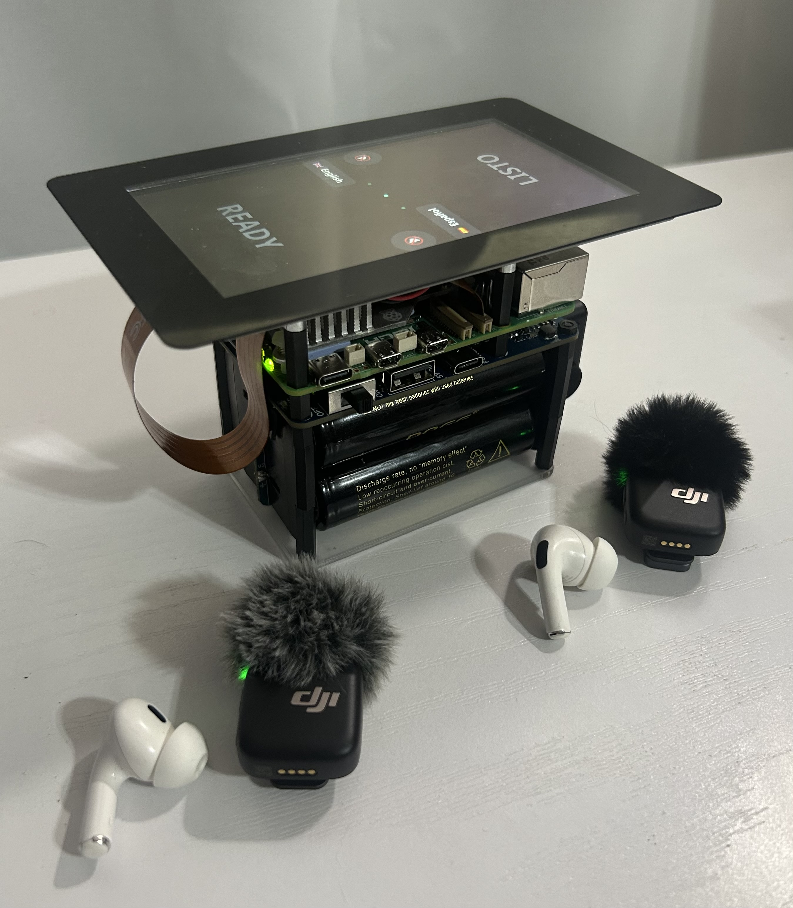
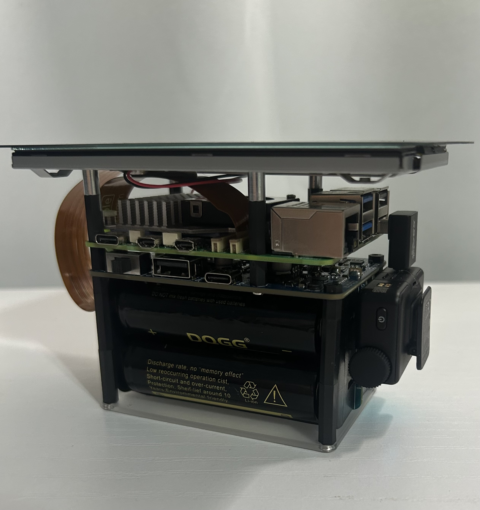
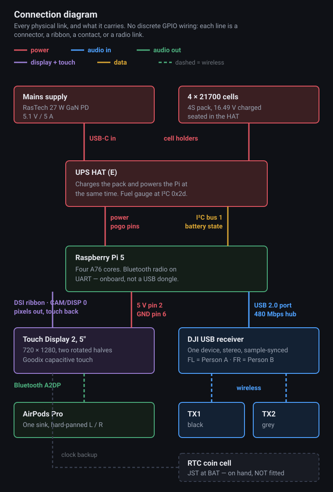
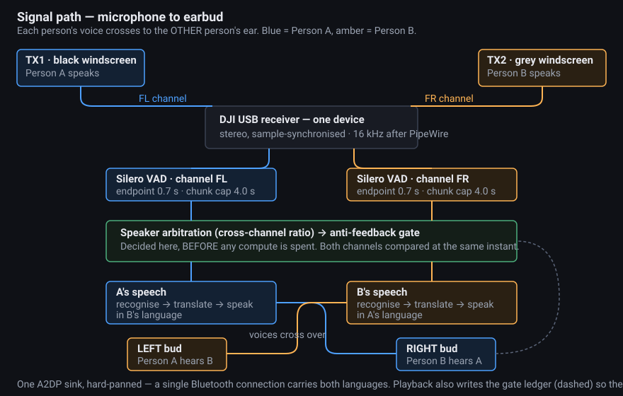
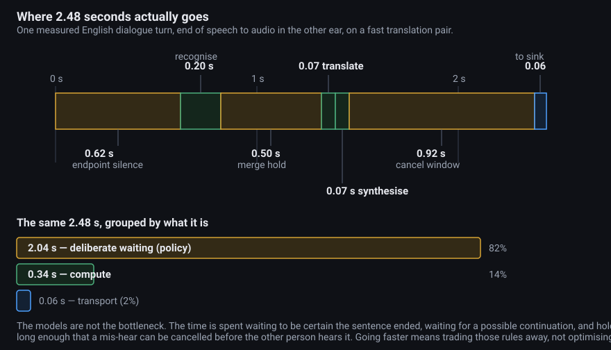

<div align="center">

# Real-Time Speech Translator V2

### Two people. Two languages. One device on the table. No internet.

Each person clips on a microphone and wears one earbud, and hears the other in their own language — a real two-way conversation, not one-way dictation.

**51 languages · every model runs on the device · nothing leaves the hardware**



</div>

Those 51 languages include **17 of the world's 20 most-spoken**, so most conversations it will ever be asked to hold are already covered. Speech recognition, translation and speech synthesis all run on a Raspberry Pi 5 — no phone, no app, no account, no API key, and no network of any kind. A translation takes **2.5–4 seconds** end to end.

---

# 🎥 Demo

**[English to Spanish, spoken live](media/demo_translation.mp4)** — one person speaks English, the transcript and the Spanish translation appear on screen, and the translation reaches the other earbud a couple of seconds later.

*Audio here is what the earbud heard — added to the recording, since the camera could not.*



Everything above is in that stack: display, Pi 5 and cooler, the UPS HAT carrying four 21700 cells, and the wireless microphone receiver.

---

# 🌍 Project Background

[Version 1](https://github.com/TobyM-engineering/Real-Time-Speech-Translator) was one-directional and cloud-based: a Pi Zero 2 W streamed audio to OpenAI's realtime API and played English into one ear. It worked, cost ~$65 in parts and ~$10 per 30 minutes of use.

The obvious question was whether the cloud was doing anything that couldn't be done locally. **V2 is the answer: every model runs on the device.** That buys three things the cloud version could not have:

- **Privacy by construction.** Nothing is transmitted, so nothing can be intercepted, logged or billed.
- **No running cost and no network.** It works on a plane, in a basement, or anywhere roaming is a bad idea.
- **Two directions at once.** Two microphones, two earbuds, two languages, one device between two people.

What it costs, honestly: roughly **$400** in parts instead of $65, and 2.5–4 seconds per turn where the cloud version managed a bit over one.

---

# 🛠 System Overview

## Hardware

| Part | Why this one |
|---|---|
| [Raspberry Pi 5, 8 GB](https://www.raspberrypi.com/products/raspberry-pi-5/) | Four A76 cores — **compute is the binding constraint, not memory** (~2 GB resident) |
| [Official Active Cooler](https://www.raspberrypi.com/products/active-cooler/) | Not optional: throttling at 85 °C costs 37% of every stage |
| [Touch Display 2, 5″](https://www.raspberrypi.com/products/touch-display-2/) | 720×1280 portrait, split into two 180°-opposed halves |
| [SanDisk 64 GB High Endurance microSDXC](https://www.amazon.com/dp/B07P3D6Y5B) | Endurance-rated: a battery device gets hard-cut, and ordinary cards degrade |
| [Waveshare UPS HAT (E)](https://www.amazon.com/dp/B0DBLMFX57) + [4× 21700 cells](https://www.amazon.com/dp/B0HDZ2MTGX) | Portable, with an I²C fuel gauge so low battery is *known*, not guessed |
| [RasTech 27 W GaN PD, 5.1 V / 5 A](https://www.amazon.com/dp/B0CLV6WB4L) | Feeds the HAT's USB-C input — 5 A because it charges the pack *and* runs the system |
| [DJI Mic Mini kit](https://www.dji.com/mic-mini) | **Both microphones through one USB device, sample-synchronised** — the whole design rests on this |
| [NFHK 90° down-angled adapter](https://www.amazon.com/dp/B0C7GLCWKC) | The down-angle is load-bearing; other adapters foul the stack |
| [Longer Pi 5 DSI FPC ribbon](https://www.amazon.com/dp/B0D12N6TLW) | The stock 200 mm ribbon does not reach in a stacked layout |
| [XYGStudy Pi 5 RTC battery](https://www.amazon.com/dp/B0CR76SM52) | For offline timekeeping — **on hand, not yet fitted** |
| AirPods Pro | One stereo sink, hard-panned: left bud to one person, right to the other |

**[→ hardware/hardware.md](hardware/hardware.md)** gives the full reasoning for every part, including which substitutions will break the build.

## Wiring

- **Display ribbon → `CAM/DISP 0`** (*not* the PCIe port) · **display power → GPIO pin 2 (5 V) and pin 6 (GND)**
- **Fan → the 4-pin `FAN` header** · **DJI receiver → a black USB 2.0 port**, via the 90° adapter
- **Mains → the UPS HAT's USB-C input**, not the Pi's



Every physical link and what it carries — **[full size, with notes on what was verified](hardware/diagrams/wiring-diagram.svg)**.

---

# 🧩 How It Works



Both microphones arrive sample-synchronised through one receiver, which is what makes the design work. **Speaker identity comes from the cross-channel energy ratio, never from loudness:** a chest microphone hears its wearer 10–17 dB louder than the other person's does, no matter how loudly either talks.

Recognition is routed per language — Parakeet for English, SenseVoice for Chinese/Japanese/Korean, whisper with the language pinned for the other 47. Translation uses small per-pair opus-mt models where they exist, with NLLB-200 as a universal fallback. Speech synthesis is Piper.

The screen is split in two, one half rotated 180°, each showing a state colour, the live transcript and a mute control. **The transcript is also a cancel button** — text appears well before audio does, so a mis-hear can be killed before the other person hears it.

**[→ software/how_it_works.md](software/how_it_works.md)** — the signal path, speaker separation, all three recognition engines and why each was chosen.

---

# 📊 Performance — the honest numbers



| Path | Measured |
|---|---|
| English → Spanish, short turn (opus pair) | **~2.5 s** |
| Spanish → English (whisper recognition) | **~3–4 s** |
| Any pair falling back to NLLB | **3.5–5 s per sentence** |
| Long monologues | first audio arrives *while still speaking* |
| Power-on → ready on the glass | **46 s** |

Of a measured 2.48 s turn, **0.34 s is computation.** The rest is deliberate policy: waiting to be sure the sentence ended, waiting for a possible continuation, and holding audio long enough that it stays cancellable. Going faster means trading those rules away, not optimising code.

**Language coverage: 51 languages** have a complete chain — the count is set by the available voices, not by the recognition. **Eight are bench-verified** here (zh, ja, en, es, pt, de, ru, fr), with Korean effectively a ninth. The other 42 carry published-benchmark estimates, shown in the picker. **The tail fails confidently** — at 41–55% word error rate whisper does not say "I didn't understand", it produces fluent, wrong text.

---

# ⚠️ Limitations

The unedited list, from the project's own hardening audit.

**What is fragile.** Simultaneous speech works when both voices are strong on their own microphones; the weak side of an overlap in the −6..0 dB band is still discarded by design, and a bystander's voice can be decoded (even twice) instead of ignored — the mute button remains the only bystander defence. Accented speech on the non-English side costs real accuracy and ~1.5–2 s over the old (language-unstable) engine. The capture clock shows unexplained +5..+66 s excursions versus wall clock under I/O load — every pipeline decision rides the sample clock so nothing misbehaves, but the mechanism is not understood, only monitored. The DSI panel silently failed to probe on one boot (ribbon reseated; the supervisor now announces it). One AirPods sink means one shared hardware volume and SBC joint stereo — measured clean by ear, still a compromise. WAV evidence keeps only each session's first 8 turns.

**Not yet built or verified, and it matters.** No read-only root filesystem: a battery hard-cut can corrupt the SD card, and this device is a battery appliance — this is the top standing risk. EEPROM power flags unset (the DJI receiver runs inside the 600 mA USB cap — works, thin headroom). No RTC battery fitted, so fully-offline mode has no clock source. WiFi is still on. The UPS soak test under sustained ML load has not been run. The kiosk boot path was designed but not built (a desktop session hosts the UI). Unknown AirPods behaviours: one bud dying, true battery life. Known and tolerated bugs: the merge-hold deadline expires early, and the turn registry never prunes within a session.

**Two things the hardware cannot tell you.** A transmitter that is switched off is indistinguishable from a person who is not speaking — the on-screen level check is the manual test. And the language picker is a contract: speech in a language other than the one selected decodes as confident phonetic nonsense in the selected language.

---

# 🧠 Notable Engineering Problems

### Three clocks, and only one of them was right
Wall time, the capture stream's sample counter, and the voice-activity library's internal counter all disagreed — the last drifted 38 seconds over a nine-hour run. Mixing them produced failures that looked like anything but a timing bug: a gate silently comparing timestamps from different number lines, and a meter claiming the pipeline was 40 s behind while audio arrived a second later. Everything timing-critical now uses one clock, converted at one point.

### A dead thread that looked like a slow one
A punctuation-only transcript hit a guard that tested one string and indexed another. The recognition thread died while every other thread kept running, so the screen showed "translating" for five minutes as twenty turns queued into a dead consumer. Every worker is now polled every 5 s, rebuilt in place with its queue migrated, and escalated to a pipeline restart on a second death.

### Code that read as working for months
When a reply overlapped the device's own playback, the gate computed how much audio would survive trimming, logged the number, and then discarded the whole segment anyway — the "keep the rest" branch was never written. It looked correct in every log line it printed.

### A speech model that would not be told what language to expect
Parakeet runs its own language identification with no way to pin it. On short or accented Spanish it flipped to English phonetics — "bien" became "B N.", "¿cuánto cuestan?" became "Conto question." — and the nonsense was faithfully translated and spoken aloud. Native-speaker test clips never showed it; only a real non-native speaker did. It now handles English only.

### A retry ladder nobody asked for
The recognition library silently retries at five temperatures whenever its own quality check fails, which accented audio triggers constantly: a measured 2.8× multiplier, up to 26 decoder passes for one short sentence. Disabling it produced *better* text on every clip tested.

### The transmitter that lied
Microphone levels collapsed and transcripts turned to garbage. A day went into audio-path debugging, and a digital gain was added to compensate. The real cause was a transient hardware state in the transmitters, cleared by power-cycling them — after which the added gain was actively harmful. **If levels collapse, power-cycle the transmitters before touching software.**

---

# 🚀 Getting Started

Full detail, including the traps, is in **[guide/setup.md](guide/setup.md)**.

```bash
git clone https://github.com/TobyM-engineering/Real-Time-Speech-Translator-V2.git
cd Real-Time-Speech-Translator-V2
python3 -m venv venv
venv/bin/pip install sherpa-onnx faster-whisper ctranslate2 piper-tts sentencepiece \
                     transformers numpy soundfile huggingface_hub smbus2 PySide6

software/tools/fetch_models.sh                              # ~5 GB of models
sudo raspi-config nonint do_i2c 0                  # battery gauge
cp software/src/device.example.json software/src/device.json   # then fill in YOUR hardware
software/tools/run_pipeline.sh                              # READY in ~30 s cold
```

Two things that are easy to get wrong and expensive to debug:

- **Find your own hardware identifiers.** `pw-cli ls Node | grep -i Rx` for the receiver, `bluetoothctl devices` for the earbuds. `software/src/device.json` is gitignored — never commit it.
- **Never let anything open the earbuds' microphone.** Bluetooth drops to the headset profile and audio collapses to 8 kHz mono for both people. The WirePlumber configuration in [setup.md](guide/setup.md) removes that profile entirely.

Then `venv/bin/python software/tools/doctor.py` gives a plain-language health check, and `systemctl --user enable translator.service` makes it boot straight into the interface.

---

# 📌 Repo Status

✅ Full offline loop working end to end — two people, two languages, two earbuds

✅ 51 languages with a complete chain; 8 bench-verified

✅ Speaker arbitration, anti-feedback gate, push-to-talk, tap-to-cancel

✅ Automatic recovery: Bluetooth ladder, capture reopen, worker watchdog, pipeline restart

✅ Boots into the UI with no terminal and no login

🔧 Read-only root filesystem, EEPROM power flags, and kiosk boot still to do

🔧 Latency floor (~2 s) is policy-bound; clause-streamed translation is the next real win

---

# 📂 Repository Structure

```
├── hardware/     the physical build — parts, wiring, stack, power, diagrams
├── software/     all the code — pipeline (src/), ui/, tools/, tests/ — and how it works
├── screen/       every screen state, drawn and explained
├── guide/        the build guide and the build log
└── media/        photos, video and wiring diagrams
```

## Documentation

| Document | What is in it |
|---|---|
| **[guide/setup.md](guide/setup.md)** | Build guide from bare parts to autostart, with the traps that cost time |
| **[hardware/hardware.md](hardware/hardware.md)** | Every part, a link, and why *that* part — including the load-bearing choices |
| **[hardware/power_and_thermal.md](hardware/power_and_thermal.md)** | Power path, battery gauge, thermal limits, unfinished power work |
| **[software/how_it_works.md](software/how_it_works.md)** | Signal path, speaker separation, the three engines, per-stage measured latency |
| **[software/recovery.md](software/recovery.md)** | What the device does when things fail, and what it cannot detect |
| **[screen/README.md](screen/README.md)** | Every state the screen can be in, drawn, with what triggers it |
| **[guide/build_log.md](guide/build_log.md)** | The narrative: what broke, what was wrongly believed, how it was resolved |

---

# 📄 Licence

The code in this repository is MIT — see [LICENSE](LICENSE).

## Models and licences

The models are **not** in this repository. `software/tools/fetch_models.sh` downloads them from their own sources, each under its own terms:

| Model | Role | Licence |
|---|---|---|
| [NLLB-200-distilled-600M](https://huggingface.co/facebook/nllb-200-distilled-600M) | Translation fallback | **CC-BY-NC 4.0 — non-commercial** |
| [Helsinki-NLP opus-mt](https://huggingface.co/Helsinki-NLP) | Fast translation pairs | CC-BY 4.0 |
| [Whisper](https://github.com/openai/whisper) (via [faster-whisper](https://github.com/SYSTRAN/faster-whisper)) | Speech recognition, European languages | MIT |
| [NVIDIA Parakeet TDT](https://huggingface.co/nvidia/parakeet-tdt-0.6b-v3) | Speech recognition, English | CC-BY 4.0 |
| [SenseVoice Small](https://huggingface.co/FunAudioLLM/SenseVoiceSmall) | Speech recognition, Chinese / Japanese / Korean | FunASR model licence (weights) — see the model card |
| [Piper voices](https://huggingface.co/rhasspy/piper-voices) | Speech synthesis | Varies per voice — check each voice's `MODEL_CARD` |

This repository's MIT licence covers my code only; the models are downloaded separately under their own terms, and NLLB's non-commercial licence means the device as configured is not for commercial use.
