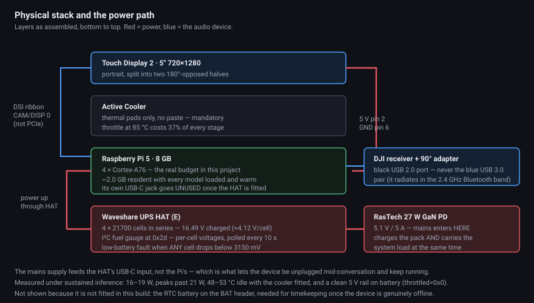

# Hardware

Every part in the build, with a link and the reason **that specific part** was chosen. Where a choice is arbitrary, this file says so; where a substitution will break something, it says that too.

Roughly **$400** all in, dominated by the Pi, the display and the DJI kit.

---

## Compute

### [Raspberry Pi 5, 8 GB](https://www.raspberrypi.com/products/raspberry-pi-5/)

Four Cortex-A76 cores at 2.4 GHz. **The four cores are the real budget in this project, not the memory** — the whole model stack measures ~2.0 GB resident with everything loaded and warm (3.1–3.4 GB including Parakeet and the interface), against 8 GB available. Every latency number in this repository is a statement about those four cores.

The 8 GB model is therefore not strictly required, but the headroom costs little and the alternative is re-measuring everything against swap.

### [Official Active Cooler](https://www.raspberrypi.com/products/active-cooler/)

**Not optional, and it uses thermal pads only — no paste.** The Pi 5 soft-caps at 80 °C and throttles at 85 °C, dropping 2.4 GHz to 1.5 GHz. That is a 37% clock cut applied to every stage of the pipeline, and it arrives exactly when the device is working hardest. Under sustained inference this build measures 16–19 W with peaks past 21 W; passive cooling does not hold that.

Measured at idle with the cooler fitted: 48–53 °C.

---

## Audio input

### [DJI Mic Mini kit](https://www.dji.com/mic-mini) — two transmitters, one USB receiver

The single most important part choice in the build, for one reason: **both microphones arrive through one USB device as a sample-synchronised stereo pair.** Two separate USB microphones would drift apart in time, and the entire speaker-separation scheme — which compares the energy of the same instant across both channels — would collapse.

It is also class-compliant USB audio (`2ca3:4011`, generic kernel driver), so no vendor software is involved.

Measured channel assignment, verified across a full power cycle of receiver and both transmitters:

| Transmitter | Windscreen | Channel | Person | Separation measured |
|---|---|---|---|---|
| TX1 | **black** | FL (left) | A | +11.5 dB over FR |
| TX2 | **grey** | FR (right) | B | +11.7 dB over FL |

Two things about this kit that will cost you an afternoon if nobody tells you:

- **Stereo mode is a hardware toggle** — double-press the link button on the receiver. Without it both microphones are summed into one channel and no software can separate the speakers. The pipeline self-checks this at startup and `tools/doctor.py` tests it explicitly.
- **Noise cancelling is a single press on each transmitter and is trivially bumped against a shirt.** It is tuned for ambient noise, not for a second talker, and it degrades recognition. Leave it off.

Alternatives considered and not needed: 2× BOYA BY-V10, Rode Wireless GO II. The DJI kit passed its channel-separation test on the first attempt and stayed.

### [NFHK 90° down-angled USB-A → USB-C adapter](https://www.amazon.com/dp/B0C7GLCWKC)

Carries the DJI receiver. **The down-angle orientation is load-bearing** — other angled adapters foul the display stack in this layout. This is a deliberate mechanical choice, not a generic substitute, and swapping it for "some right-angle adapter" will not fit.

The receiver must go in a **black USB 2.0 port**, never the blue USB 3.0 pair: USB 3.0 radiates in the 2.4 GHz band and this device is running Bluetooth audio continuously.

---

## Audio output

### AirPods Pro (or any A2DP stereo earbuds)

Used as **one stereo sink, hard-panned** — left bud to one person, right bud to the other. This is why the two people can hear different languages from a single Bluetooth connection.

Nothing here is Apple-specific, and the constraints found are likely to apply to any earbuds:

- **The microphone must never be opened.** If any process touches it, Bluetooth drops from A2DP to the headset profile and audio collapses to 8/16 kHz mono *for both people*. The WirePlumber configuration removes the headset role entirely so the profile does not exist to switch to.
- **SBC-XQ is unavailable** on these — they advertise only baseline SBC and AAC and renegotiate plain SBC even when XQ is forced. Plain SBC joint stereo was then tested by ear in its worst case (speech at full level in one bud, near-silence in the other, both directions) and was clean, so the XQ requirement was retired.

Two things remain genuinely unknown: behaviour when one bud dies first, and real battery life on a used pair.

### Onboard Bluetooth radio — *not* a USB dongle

A deliberate reversal of v1. That build used an RTL8761B USB dongle which crashed under sustained load (`hw err, trigger devcoredump`), and research showed essentially every recommended Linux Bluetooth dongle uses the same chipset family. The Pi 5's onboard Infineon/Broadcom radio is the only genuinely different silicon available here, and it has since streamed for hours with zero write failures.

---

## Display

### [Raspberry Pi Touch Display 2, 5″](https://www.raspberrypi.com/products/touch-display-2/)

720×1280 IPS, portrait-native, 5-point capacitive touch. Chosen for the geometry as much as the specification: the device sits flat on a table between two people facing each other, so the screen is split into two halves with **one rotated 180°**, and each person reads their own half right-side up.

The active area is 62.3 × 110.7 mm — so each person's half is 62.3 × 55.4 mm at 293.7 ppi. Type sizes were derived from that measurement at a 0.5 m viewing distance rather than guessed: body text ≥ 48 px, status words ~90 px, touch targets ≥ 140 px.

### [Longer official Pi 5 DSI FPC ribbon](https://www.amazon.com/dp/B0D12N6TLW)

Replaces the stock 200 mm ribbon, which does not reach in the stacked layout. *Length unmeasured — it is simply longer than stock.*

Worth knowing, because it cost a debugging session: **a partially-seated ribbon produces a completely black screen with no error anywhere.** The panel simply never probes — no DSI connector appears in `/sys/class/drm`, no backlight device exists, and the kernel log says nothing at all, while the pipeline runs happily underneath. The supervisor now detects and reports this at startup.

The display connects to **`CAM/DISP 0`**, not the PCIe port, and needs **5 V on GPIO pin 2 and ground on pin 6** — the ribbon alone does not power it.

---

## Power

### [Waveshare UPS HAT (E)](https://www.amazon.com/dp/B0DBLMFX57) + [4 × 21700 cells](https://www.amazon.com/dp/B0HDZ2MTGX)

Makes the device portable, which is the entire point of a translator you carry to a conversation. 4S pack, measured at 16.49 V (≈4.12 V per cell) fully charged.

Chosen over simpler power banks for the **I²C fuel gauge at address `0x2d`**, which is what makes the on-screen battery indicator and the low-battery warning possible rather than guesswork. The supervisor polls it every 10 seconds and reads pack voltage, current, state of charge, and all four per-cell voltages.

The low-battery fault fires when **any single cell drops below 3150 mV** while discharging — Waveshare's own cutoff, after which their firmware force-shuts-down about 60 seconds later. Surfacing it as a warning well before that is the difference between a graceful stop and an unclean power loss on a device with an SD card in it.

*Cell brand and model are unverified — these are what is in this build, not a recommendation.*

Verified on the bench across a full battery session: `throttled=0x0` throughout, meaning the 5 V rail stayed clean under sustained inference load.

### [RasTech 27 W GaN PD USB-C supply, 5.1 V / 5 A](https://www.amazon.com/dp/B0CLV6WB4L)

The only mains supply in the build, and it plugs into the **UPS HAT's USB-C input, not the Pi's**. In that configuration the HAT charges the 4×21700 pack and powers the Pi simultaneously — that is the normal operating path, and the Pi's own USB-C jack goes unused once the HAT is fitted.

**The 5.1 V / 5 A rating is the reason for this specific part.** Carrying the full system load and charging the pack at the same time is two jobs at once; a typical 15–18 W phone charger forces the HAT to choose between them, and charging stalls or the rail sags under inference load.

It also powers the Pi directly through its USB-C jack for bench work without the battery, which is how the build ran before the HAT and cells were fitted.

### [SanDisk 64 GB High Endurance microSDXC (SDSQQNR-064G-GN6IA)](https://www.amazon.com/dp/B07P3D6Y5B)

Boot device and model storage — about 5 GB of models plus the operating system.

**High-endurance specifically, not a general-purpose card.** This is a battery device that can lose power hard, and an ordinary card's flash translation layer degrades under repeated unclean shutdowns; the endurance line is designed for continuous-write dashcams and video recorders and tolerates it. The honest caveat is that a better card reduces the risk rather than removing it — a read-only root filesystem is the real fix and is **not yet built**, which makes this the top standing risk in the project.

### [XYGStudy Pi 5 RTC battery (RTC-Bat-B)](https://www.amazon.com/dp/B0CR76SM52)

64 mAh rechargeable, 2-pin JST, connects to the `BAT` header. **On hand but not yet fitted.**

It matters more than it looks: a genuinely offline device has no NTP, so with no RTC it boots with no idea what time it is. Fit this before relying on offline mode.

---

## What the wiring looks like

- **Display ribbon → `CAM/DISP 0`** (*not* the PCIe port), 22-pin at the Pi, 15-pin at the display
- **Display power → GPIO pin 2 (5 V) and pin 6 (GND)**
- **Fan → the 4-pin `FAN` header**
- **DJI receiver → a black USB 2.0 port**, via the 90° down-angled adapter
- **RTC battery → the `BAT` JST connector** (not fitted in this build)
- **Mains → the UPS HAT's USB-C input** (not the Pi's, once the HAT is fitted)

<!-- ═══ MEDIA SLOT 2 of 2 — wiring diagram ════════════════════════════
     Drop hardware/wiring_diagram.png in, then delete this comment's
     opening and closing markers to publish the block.
     Naming convention: ../hardware/README.md
════════════════════════════════════════════════════════════════════════

Every connection above, drawn: the display ribbon at `CAM/DISP 0`, display power on GPIO pins 2 and 6, the fan header, the receiver on a black USB 2.0 port, and mains entering at the UPS HAT rather than the Pi.

═══ END MEDIA SLOT 2 ═════════════════════════════════════════════════ -->
