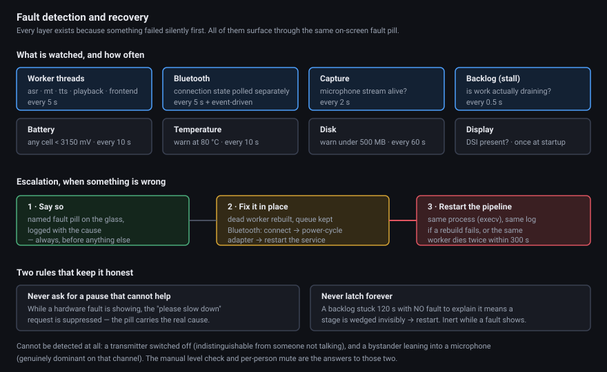

# Faults and Recovery

The governing principle: **a failure the user cannot see is worse than a failure they can.** Every layer here exists because something failed silently first.

---

## The layers

| Layer | Watches | Cadence | Response |
|---|---|---|---|
| Capture monitor | The microphone stream | 2 s | Reopen, with different backoff for "died instantly" vs "died after running" |
| Bluetooth ladder | Earbud connection and write health | 5 s + event-driven | Three escalating rungs |
| Worker liveness | Every pipeline thread | 5 s | Named fault, rebuild in place, then pipeline restart |
| Stall watchdog | Whether work is actually draining | 500 ms | Pipeline restart when nothing else explains it |
| Thermal | Core temperature | 10 s | Warning at 80 °C |
| Battery | Per-cell voltage over I²C | 10 s | Warning below 3150 mV on any cell |
| Disk | Free space | 60 s | Warning below 500 MB |
| Display | DSI connector presence | startup | Warning, with the physical fix named |

All of them surface through the same on-screen fault pill, and every transition is logged.

---

## Bluetooth: escalate, never repeat

The lesson is inherited from v1, where one log showed **43 identical failed reconnect attempts over eleven minutes**. Retrying the same thing is not recovery.

The ladder, for the onboard radio:

1. **L0** — `bluetoothctl connect`
2. **L1** — power-cycle the adapter, then connect
3. **L2** — `systemctl restart bluetooth` (needs root; logged loudly if denied)

Connection state is polled **independently of write failures**, because the two fail differently: a disconnect between polls can be missed entirely while writes appear healthy, so an event-driven `bluetoothctl` monitor catches disconnects however brief. On recovery the output stream is rebuilt.

**The one place audio is deliberately discarded:** on recovery, already-translated audio older than 10 seconds is dropped. Speech delivered a minute late is worse than a gap. This applies only to the recovery path — normal operation never drops anything.

Observed in practice: the ladder ran for hours with the earbuds sitting in their case, cycling correctly and showing the fault the whole time, then reconnected the moment the case was opened.

---

## Worker liveness — the failure that prompted the rest

A recognition thread died on an unhandled exception (a punctuation-only transcript hitting a guard that tested one string and indexed another). Everything else kept running. The interface showed "translating" **for five minutes**, twenty turns queued into a dead consumer, and nothing anywhere said a thread had died.

Now every worker thread — recognition, translation, synthesis, playback, and the audio frontend — is polled every 5 seconds through live references, so a *restarted* worker is monitored rather than its corpse.

When one dies:

1. Log `FAULT worker thread 'X' is DEAD`
2. Show a fault pill naming the stage: *"Translator fault (asr) — recovering…"*
3. Rebuild it in place — fresh instance, same wiring, **queue migrated so pending turns survive**, models reloaded
4. Clear the pill on success

Escalation to a whole-pipeline restart (via `execv`, which preserves the process ID and the log redirect) happens if the rebuild fails, or if the same worker dies **twice within 300 seconds** — a second death means a persistent cause that rebuilding will not fix.

The audio frontend is monitored but deliberately has no in-place rebuild — its capture and voice-activity state cannot be safely reconstructed — so its death escalates straight to a pipeline restart. Deafness must not be silent.

Measured on a deliberately sabotaged worker: death detected in under 5 seconds, rebuilt and warm in **7.2 s**, and the next decode produced real text. A second kill 12 seconds later escalated correctly.

---

## The backlog meter, and not lying about it

The device tracks how far behind it is — measured as the age of the speaker's oldest turn that has not yet reached the ear. Thresholds: a numeric meter from 8 s, a soft pause request at 15 s, a hard one at 30 s.

Two rules keep it honest:

**It does not ask you to pause when pausing will not help.** While any hardware fault is showing — earbuds gone, a dead stage, the microphone lost — the pause request is suppressed. The fault pill carries the real cause. Telling two people to speak more slowly because the earbuds are in their case is a lie, and the earlier version told it.

**It cannot latch forever.** A hard backlog held for 120 seconds with **no fault to explain it** means a stage is wedged invisibly — alive, so the liveness watchdog cannot see it, but not working. That escalates to a pipeline restart. The escalation is deliberately inert while a fault *is* showing, so earbuds in a case can never trigger a restart loop.

---

## When a turn produces nothing

Speech that cannot be translated is never silently dropped, and an unverified translation is never spoken.

- **Recognition returns nothing** on at least 0.5 s of accepted audio → one fallback decode by a different engine, loudly logged. This exists because one engine was found returning empty transcripts *deterministically* on perfectly clean speech — eight instances across five bench sessions before anyone noticed.
- **Still nothing** on ≥1 s of audio → the listener hears a soft two-tone marker and sees a warning symbol; the speaker's own transcript line is struck through.
- **Every sentence discarded** by the hallucination detector → same treatment. The gap is visible.
- **Non-speech rejected** (a cough, a bump — under 1.5 s and 2 words, cross-checked against a second engine) → dropped silently *by design*, because nothing was actually said, but logged.

---

## What no layer can catch

Stated plainly, because pretending otherwise would be worse:

- **A transmitter that is switched off** is indistinguishable from a person who is not talking. There is no signal to detect. The on-screen level check is the manual test.
- **A bystander leaning toward someone's microphone** is genuinely dominant on that channel and passes every test the arbitration can apply. Per-person mute is the only defence.
- **A fault on a dead display** cannot be seen. The log records it and the pill renders on HDMI, but a black panel shows nothing by definition.
