# The Screen

Every state the screen can be in, drawn at full size from the interface source in [`../software/ui/signal_live.qml`](../software/ui/signal_live.qml). Each picture below is 720 × 1280 — the real panel, at the real pixel sizes, so what you see is what a person sitting at the table sees.

**How to read these.** The device lies flat between two people facing each other. The screen is two halves of 634 px with a 12 px black strip between them, and **the top half is rotated 180°** so each person reads their own half right way up. Throughout this document the **bottom half is Person A speaking English** — the reader's own side — and the top, upside-down half is Person B speaking Spanish.

Colour carries the state before any word does: the entire half changes, which reads at a glance and from an angle. The word underneath is confirmation, and it appears in that person's own language.

| State | Half background | Ring |
|---|---|---|
| Ready | `#101216` near-black | `#3A3D42` grey, faint |
| Listening | `#0B4030` green | `#2EE6A8` bright green, pulsing |
| Translating | `#413306` amber | `#F5C542` bright amber |
| Speaking | `#0E2F52` blue | `#5AB0FF` bright blue |
| Muted | `#2A0B0F` dark red | `#FF5A6E` red |
| Falling behind (soft) | `#4A3A06` deep amber | `#F5C542` |
| Falling behind (hard) | `#5A1010` deep red | `#FF5A6E` |

---

## Starting up

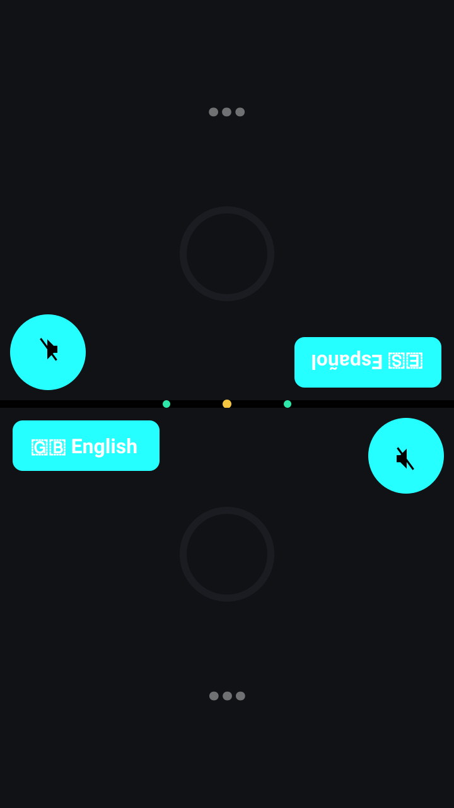

**What triggers it:** power-on. The interface appears within a couple of seconds, but the models take about 30 more to load. Until they are warm the centre dot is amber and each half shows an ellipsis instead of a status word — there is no splash screen and no progress bar.

**What to do:** wait. The dot turns green at ready, roughly 46 seconds from power-on.

---

## Nobody speaking

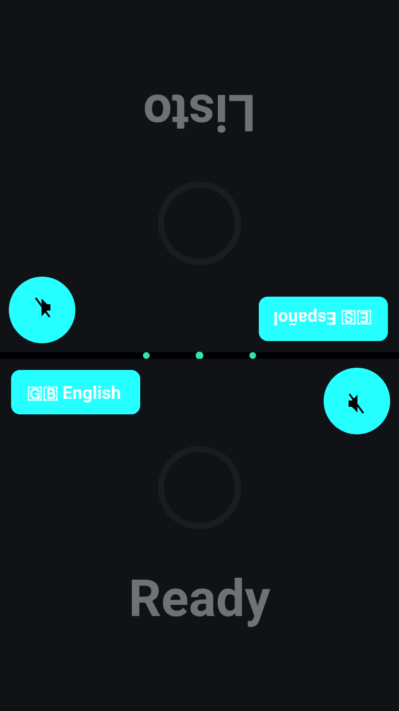

**What triggers it:** the resting state. Both microphones are open and nothing has crossed the voice-activity threshold.

**What to do:** talk. Nothing needs pressing. The faint ring and the dimmed word are deliberate — an idle device should not draw the eye.

---

## Person A speaking

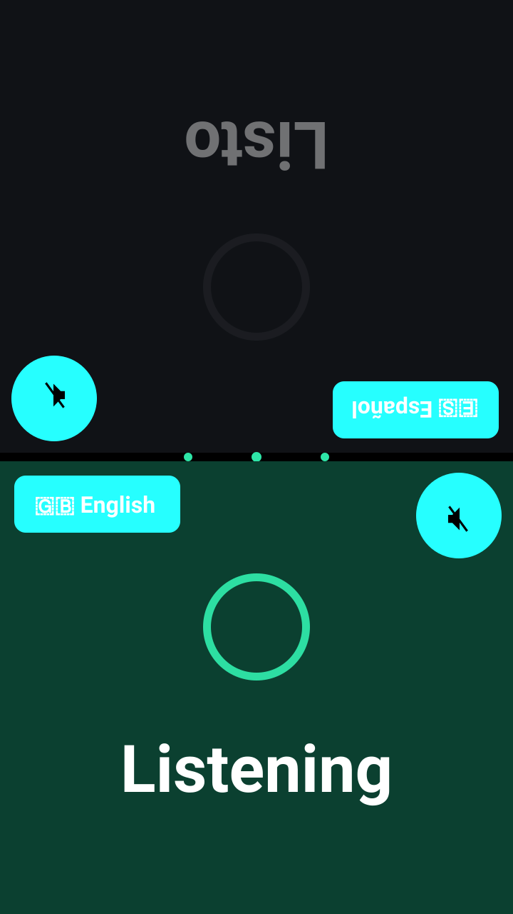

**What triggers it:** your voice arriving on your own microphone at least 6 dB louder than on the other person's. Only your half lights: the other microphone hears you too, but the cross-channel ratio test suppresses it, so the wrong half never flashes.

**What to do:** keep talking. The half stays green until you have been quiet for about 0.7 s.

---

## Person B speaking

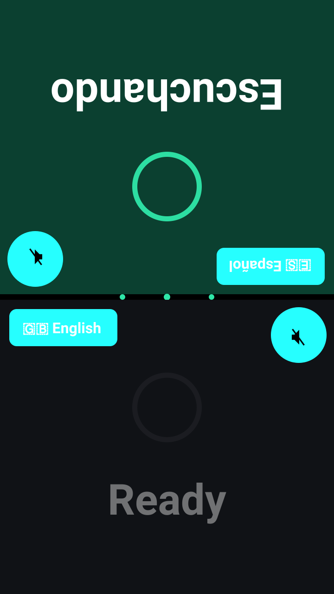

**What triggers it:** the same test on the other channel. Shown here to make the rotation concrete — Person B's half is upside down from where you sit, and right way up from where they sit.

**What to do:** listen. Their translation will arrive in your ear in a couple of seconds.

---

## Both speaking at once

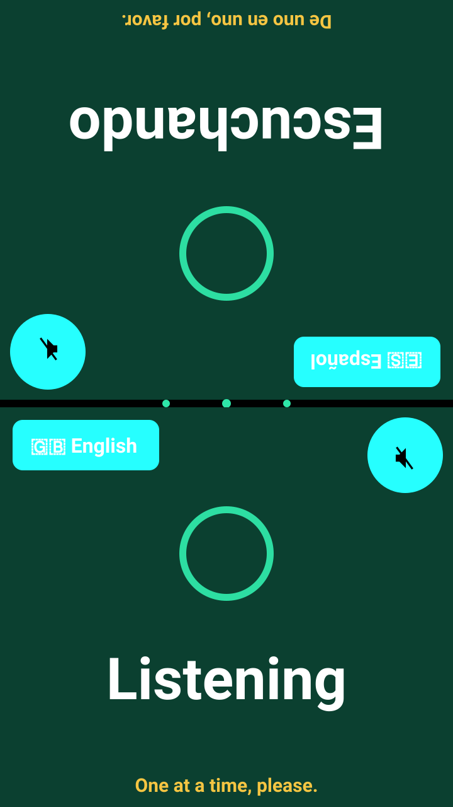

**What triggers it:** both channels active at the same time. Each half shows a short hint along its own bottom edge, in its own language.

**What to do:** one of you stop — but this is advice, not a failure. Simultaneous speech is handled whenever both voices are strong on their own microphones. Only in the narrow band where one voice is weak does anything get held back, and even then the quieter side is queued and decoded once the dominant speaker stops.

---

## Translating

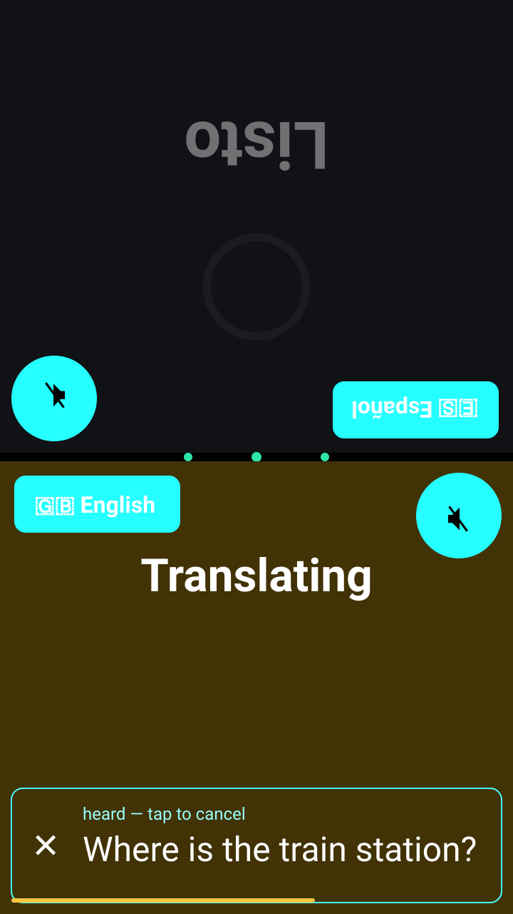

**What triggers it:** you stopped speaking and recognition finished. The half turns amber and the **transcript band** appears with what the device heard. Note that the ring is gone — the band takes over the half completely, and the status word shrinks from 92 px to 64 px and moves to the top to make room.

**What to do:** read it. If it is wrong, **tap anywhere on the band** — the whole thing is the cancel button, not just the ✕. The bar along the bottom drains over five seconds. You have from about 1.7 s after you stop speaking until the audio starts, and the pipeline will never start audio less than a second after the text appears.

---

## A translation playing in this ear

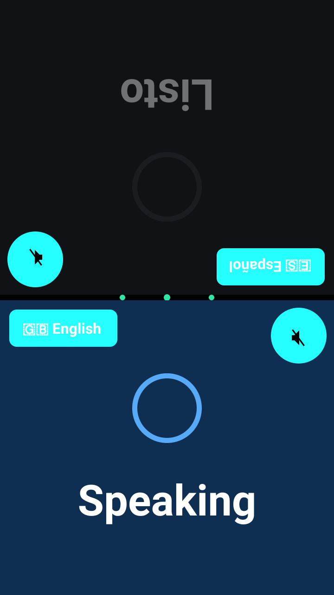

**What triggers it:** audio playing into *that person's* earbud. Because each person hears the other, a blue half belongs to the listener, not the speaker.

**What to do:** listen. You can talk over it, but the anti-feedback gate will trim whatever part of your speech overlaps the sound in your own ear.

---

## Muted

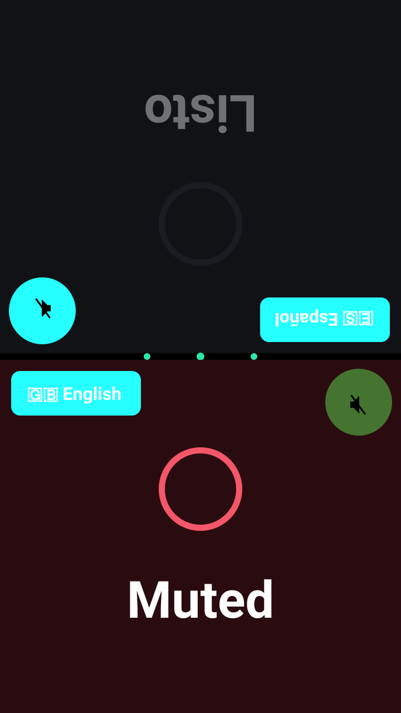

**What triggers it:** tapping the mute circle. The half goes dark red and the circle itself fills red, so it is obvious which control did it. A muted channel is dropped before anything else happens — nothing is recognised, translated or spoken.

**What to do:** tap it again to unmute. This is also the only defence against a third person talking into someone's microphone: a bystander leaning close is genuinely dominant on that channel and passes every test the device can apply.

---

## Falling behind

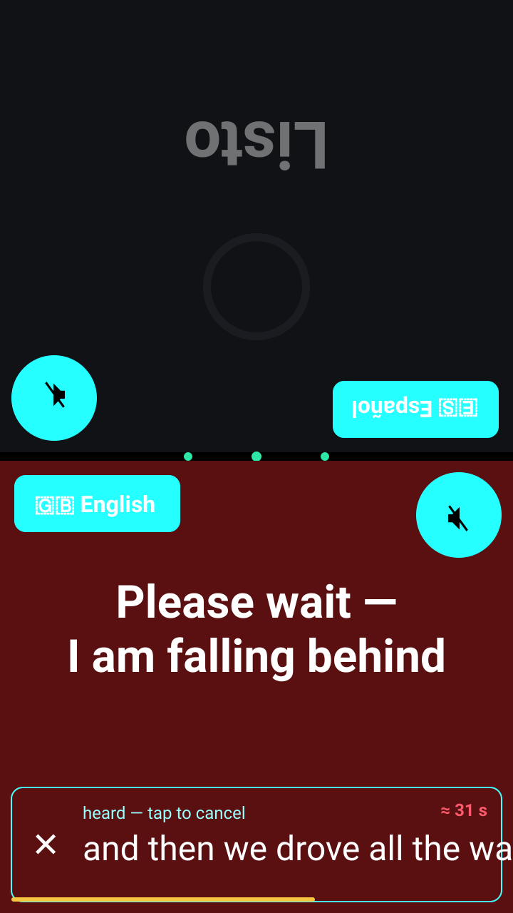

**What triggers it:** the device more than 15 seconds behind (deep amber) or 30 seconds behind (deep red). Instead of a single word the half shows a full sentence in that person's language, moved up to its own zone so it never collides with the chip or the mute button, and the band carries a counter of how far behind it is.

**What to do:** stop talking and let it catch up. Two honesty rules apply: this request is **suppressed entirely while a hardware fault is showing**, because pausing cannot fix disconnected earbuds; and if a backlog persists for two minutes with nothing to explain it, the pipeline restarts itself rather than leaving the warning up forever.

---

## Nothing came through

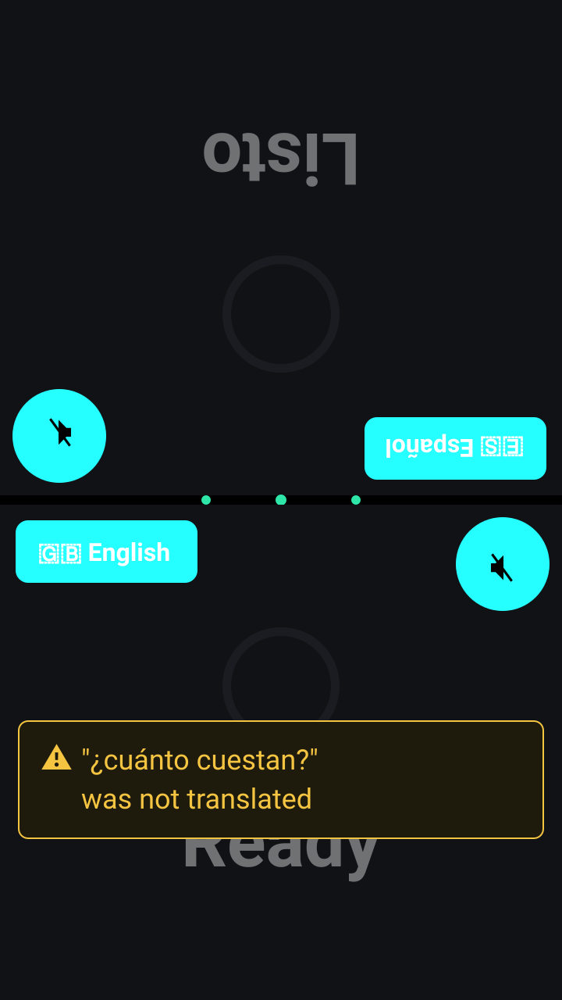

**What triggers it:** speech was heard but produced nothing translatable — every candidate sentence was discarded, or no engine could read the audio. The listener hears a soft two-tone marker and sees this panel with the untranslated words quoted. The speaker's own transcript line is struck through.

**What to do:** say it again, more simply. This state exists because the alternative is worse: **an unverified translation is never spoken, and a gap is never silent.** If it repeats, check the language picker — speech in a language other than the selected one is the usual cause.

---

## Turn cancelled

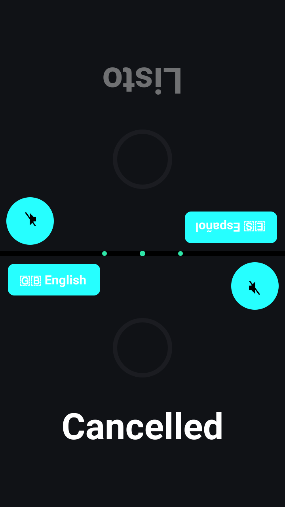

**What triggers it:** tapping the transcript band. The half flashes dark red with *Cancelled* in that person's language, then returns to its previous state.

**What to do:** nothing. Everything queued for that turn is killed, and audio already sounding is cut with a short fade rather than left to finish.

---

## Hold-to-talk

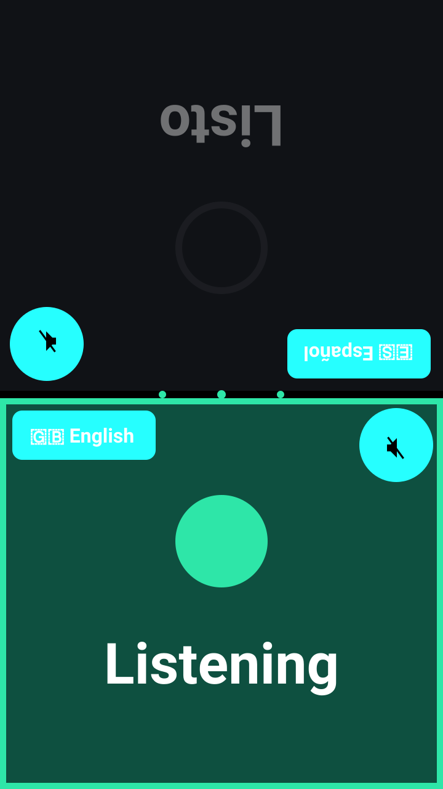

**What triggers it:** pressing and holding your own half's background for one second. The half brightens, a 10 px green frame appears around it, and the ring is replaced by a filled dot. While held, the ratio test and the anti-feedback gate are both bypassed for you, and the other channel is dropped entirely. A shorter press does nothing — a growing ring counts the press and vanishes if you let go early.

**What to do:** use it in a noisy room, or when the other microphone keeps winning. Release to return to normal. Mute still overrides it.

---

## Language picker open

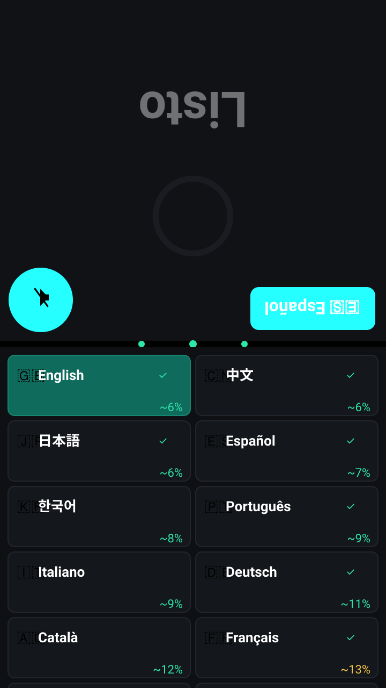

**What triggers it:** tapping the language chip. The grid covers that half only — the other person keeps using the device while you choose.

**All 51 languages are in this list.** Two columns of 122 px cells means **ten are visible at a time and the remaining 41 are below the fold**; the picture shows the sixth row cut off at the edge, which is exactly what the screen does. The order is pure accuracy, best first: each cell carries the flag, the native name, a colour-coded error rate (green under 12%, amber to 25%, red above), and a green ✓ on the eight languages bench-verified on this hardware. There are no sections and no headings — scrolling down simply means getting worse, and that is the message.

**What to do:** drag to scroll, then tap a language. Its two voices load in about two seconds, once, at this moment rather than during a conversation. Tapping beside the grid closes it unchanged.

> **Known gap:** the grid scrolls but draws **no scrollbar** — the source has none, so nothing on screen tells you the list continues past the cut edge. The partial row is the only clue. Worth adding.

---

## Microphone check

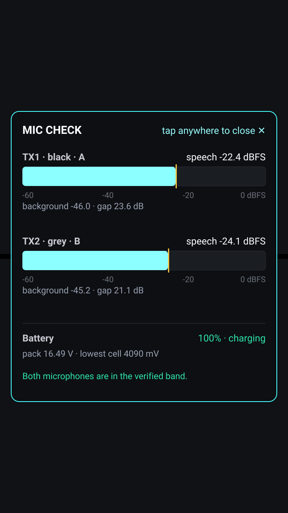

**What triggers it:** tapping the dot in the centre strip. A panel covers the screen with a live meter per channel: current level in dBFS, the background noise floor, the gap between them, and battery state at readable size.

**What to do:** use this before blaming the software. Worn speech should sit around −21 to −26 dBFS with at least 10 dB over the room. **If a level has collapsed, power-cycle the transmitters first** — that has been the cause every time so far. Tap anywhere to close.

---

## Device fault

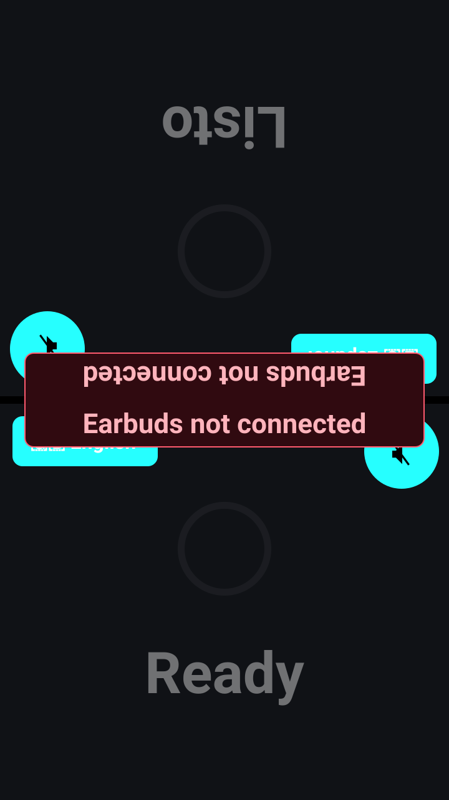

**What triggers it:** anything the supervisor detects — earbuds gone, microphone lost, battery low, storage nearly full, a dead pipeline stage, or a display that never probed. The pill sits across the centre and **the text is drawn twice, once rotated**, so both people can read it. The centre dot turns amber.

**What to do:** what the pill says. It names the specific thing rather than a code, and recovery is usually already running underneath — the earbud fault clears by itself when you open the case.

---

## Not present in the interface

Stated so nobody goes looking:

- **There is no volume control.** Per-ear digital gain exists in the pipeline configuration (`EAR_GAIN`) but is not exposed on screen, and Bluetooth volume is per-sink, so it is shared between both people. Changing it means editing configuration.
- **There is no settings page**, no keyboard and no menu. The language chip, the mute circle, the transcript band, the centre dot and press-and-hold are the entire interface.
- **Nothing shows which translation engine a pair is using** — a pair running the slow universal fallback looks identical to a fast one, and only the log says which.
