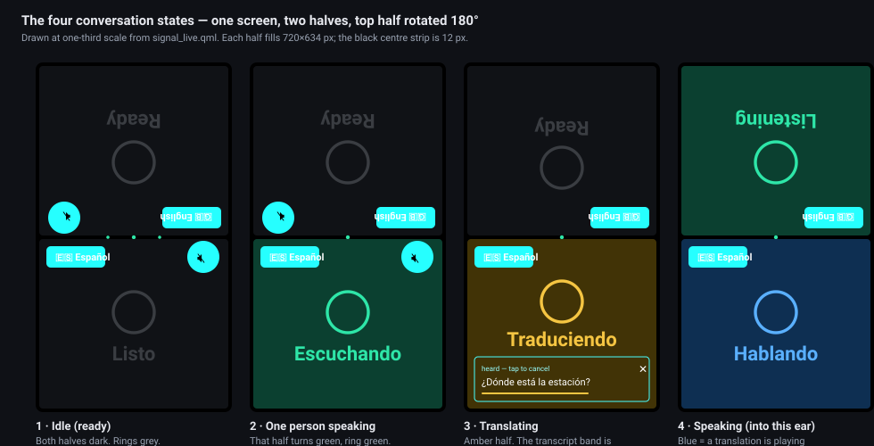
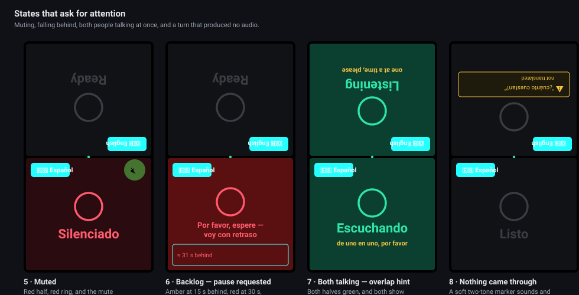
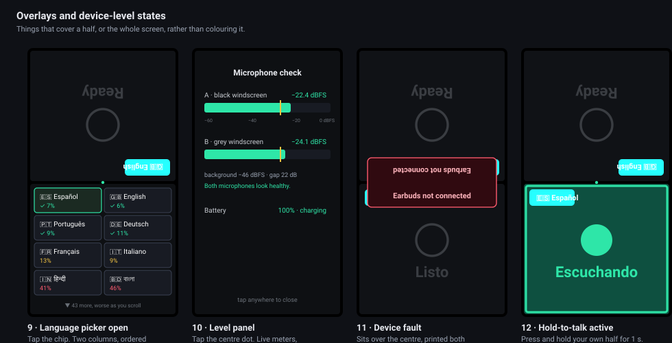

# Screen States

Every distinct state the screen can be in, drawn from the interface source in [`signal_live.qml`](signal_live.qml), with what puts it there and what you should do about it.

The screen is 720 × 1280, portrait, and it lies flat on the table between two people facing each other. It is split into two halves of 634 px with a 12 px black strip between them, and **the top half is rotated 180°** so each person reads their own half right way up. Everything below is drawn at one-third scale.

Colour carries the state before any word does — the whole half changes, which is readable at a glance and from an angle. The words are there for confirmation, and they appear in that person's own language.

| State | Half background | Ring |
|---|---|---|
| Ready | `#101216` near-black | `#3A3D42` grey |
| Listening | `#0B4030` green | `#2EE6A8` bright green |
| Translating | `#413306` amber | `#F5C542` bright amber |
| Speaking | `#0E2F52` blue | `#5AB0FF` bright blue |
| Muted | `#2A0B0F` dark red | `#FF5A6E` red |
| Falling behind (soft) | `#4A3A06` deep amber | `#F5C542` |
| Falling behind (hard) | `#5A1010` deep red | `#FF5A6E` |

---

## The conversation states

### 1 · Idle

Both halves near-black, both rings grey, the word *Ready* in each person's language. The dot in the centre strip is green, which is the only indication that the models are loaded and the device is listening.

**What to do:** talk. Nothing needs pressing.

### 2 · One person speaking

The speaker's half turns green the moment their voice is detected on their own microphone. Only their half lights — the other person's microphone hears them too, but the cross-channel ratio test suppresses it, so the wrong half does not flash.

**What to do:** keep talking. The half stays green until you stop for about 0.7 s.

### 3 · Translating

The half turns amber, and the **transcript band** appears with what was heard. The band is a button: tapping anywhere on it cancels that turn before the other person hears it. A thin bar drains across the bottom showing the time remaining, and the ✕ marks it as cancellable.

**What to do:** read what it heard. If it is wrong, tap the band. You have from roughly 1.7 s after you stop speaking until the audio starts — normally 1–2 seconds.

### 4 · Speaking

The half turns blue while a translation is playing **into that person's earbud**. Because each person hears the other, the blue half is the *listener's*, not the speaker's.

**What to do:** listen. Speaking now is possible but the anti-feedback gate will trim any part of it that overlaps the audio in your own ear.

---

## When something needs attention

### 5 · Muted

The half goes dark red, the ring red, and the mute circle itself fills red so it is obvious which control did it. A muted channel is dropped before anything else in the pipeline — nothing is recognised, translated, or spoken.

**What to do:** tap the mute circle again to unmute. This is also the only defence against a bystander talking into someone's microphone, so it is worth reaching for when a third person joins.

### 6 · Falling behind

If the device gets more than 15 seconds behind, the half turns deep amber and shows a full sentence — not a word — asking that person to pause, written in their own language. At 30 seconds it turns red. A small meter shows roughly how far behind it is.

**What to do:** stop talking and let it catch up. Two honesty rules apply here: this request is **suppressed entirely while a hardware fault is showing**, because pausing cannot fix disconnected earbuds; and if a backlog persists for two minutes with no fault to explain it, the pipeline restarts itself rather than leaving the warning up forever.

### 7 · Both talking at once

Both halves go green, and both show a short hint — *one at a time, please* — each in its own language. Simultaneous speech is handled when both voices are strong on their own microphones; in the narrow band where one voice is weak, the quieter side is queued and decoded after the dominant speaker stops, or dropped if it is mostly the other person's voice.

**What to do:** one of you stop. The hint is advice, not a failure — most overlaps still get through.

### 8 · A turn that produced nothing

If speech was heard but nothing translatable came out of it, the listener hears a soft two-tone marker and their half shows a warning symbol with the untranslated words in quotes. The speaker's own transcript line is struck through. This is deliberate: **an unverified translation is never spoken**, and a gap is never silent.

**What to do:** say it again, more simply. If this happens repeatedly, check the language picker — speech in a language other than the selected one is the usual cause.

---

## Overlays and device states

### 9 · Language picker

Tapping the language chip covers that half with a two-column grid of all 51 languages, **ordered by measured accuracy, best first**. Each cell shows the flag, the native name, and a colour-coded error rate; a green ✓ marks the eight languages bench-verified on this hardware. There are no sections and no headings — scrolling down simply means getting worse, which is the message.

**What to do:** tap a language. Its two voices load in about two seconds, once, at this moment rather than during a conversation. Tapping beside the grid closes it unchanged.

### 10 · Microphone level panel

Tapping the dot in the centre strip opens a full-screen panel with a live meter per channel: current level in dBFS, the background noise floor, the gap between them, and the verified band marked on the scale. Battery percentage and charge state are shown here at readable size.

**What to do:** use it before blaming the software. Worn speech should sit around −21 to −26 dBFS with at least 10 dB over the room. If a level has collapsed, **power-cycle the transmitters first** — that has been the cause every time so far. Tap anywhere to close.

### 11 · Device fault

A red pill sits across the centre of the screen with the fault in plain words — *Earbuds not connected*, *Microphone lost — check the DJI receiver*, *Battery low — charge now*, *Storage almost full*, *Translator fault (asr) — recovering…*, *Display not detected — check the ribbon*. The text is drawn **twice, once rotated**, so both people can read it. The centre dot turns amber.

**What to do:** what the pill says. It names the specific thing rather than a code, and recovery is usually already running underneath — the earbud one clears by itself when you open the case.

### 12 · Hold-to-talk

Pressing and holding your own half's background for one second claims your microphone: the half brightens, a bright green frame appears around it, and the state ring becomes a filled pulsing dot. While held, the ratio test and the anti-feedback gate are both bypassed for you and the other channel is dropped entirely. A shorter press does nothing — a growing ring shows the press being counted and vanishes if you release early.

**What to do:** use it in a noisy room or when the other microphone keeps winning. Release to return to normal. Mute still overrides it.

---

## Startup

From power-on, the screen shows both halves in the idle colours with the **centre dot amber** instead of green: the interface is up but the models are still loading. The dot turns green at *ready*, about 30 seconds after launch on a cold start and 46 seconds from power-on. Until then nothing is recognised.

There is no splash screen and no progress bar — the dot is the whole indication.

## Cancel confirmation

Cancelling a turn flashes that half dark red with the word *Cancelled* in the person's own language at large size, then returns to the previous state. Anything already queued for that turn is killed, and audio already sounding is cut with a short fade rather than being left to finish.

---

## Not present in the interface

Stated so nobody goes looking:

- **There is no volume control.** Per-ear digital gain exists in the pipeline configuration (`EAR_GAIN`) but is not exposed on screen, and Bluetooth volume is per-sink, so it is shared between both people. Adjusting it means editing configuration, not tapping the screen.
- **There is no settings page**, no keyboard, and no menu. The language chip, the mute circle, the transcript band, the centre dot and press-and-hold are the entire interface.
- **There is no per-person indication of which translation engine is in use** — a pair running the slower fallback translator looks identical to a fast one, and only the log says which.
